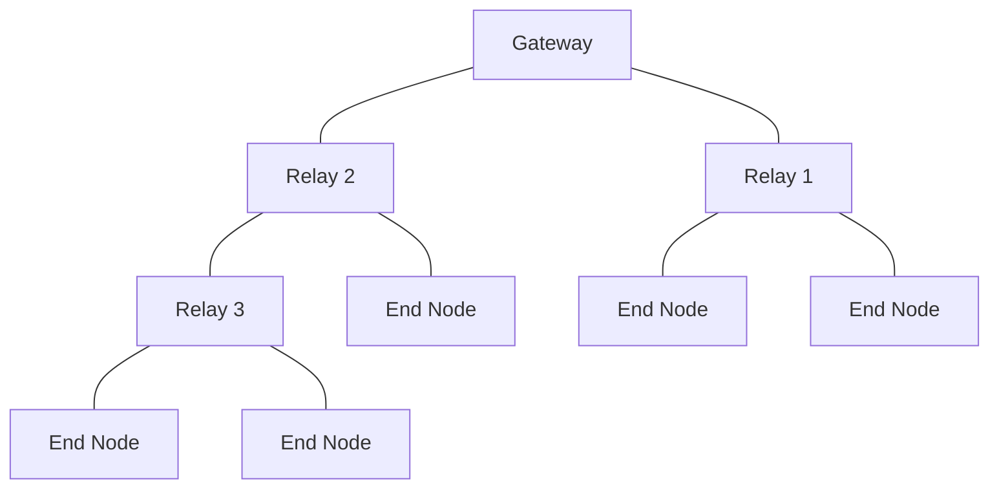

# SEAR — Synchronous Energy-Aware Relay

A custom LoRa communication protocol combining a **mesh/relay architecture** with **LoRaWAN Class B-style synchronization**, designed to extend deterministic downlink coverage beyond a gateway's direct radio range while keeping end-device power consumption close to Class A levels.

This organization hosts the two firmware repositories that make up the SEAR network:

| Repository | Role | Link |
|---|---|---|
| `end-node` | Leaf sensor device: deep-sleep, wakes on a threshold-based schedule, transmits telemetry to its parent relay | [→ repo](https://github.com/stage-LORA/End_Node) |
| `relay` | Intermediate router: re-broadcasts a Micro-Beacon to synchronize its children, buffers uplink frames, forwards them upstream (to another relay or to the gateway via OTAA) | [→ repo](https://github.com/stage-LORA/Relay) |

## Why SEAR

LoRaWAN's native star topology and its device classes force a trade-off between energy efficiency (Class A) and deterministic downlink accessibility (Class B), the latter requiring every end device to maintain a direct link with the gateway. SEAR reproduces the Class B beacon mechanism independently at every parent-child link of a tree-shaped mesh, so the deterministic reception window property propagates hop by hop instead of being confined to the gateway's direct coverage area.

## Network topology

Each `relay ↔ child` link (whether the child is another relay or an end node) runs its own independent beacon cycle, and each relay maintains a store-and-forward buffer that is flushed toward its own parent only when that parent's beacon is received — decoupling the reception window served to children from the upstream transmission.

## Getting started

Each repository is self-contained and has its own build/flash instructions (Docker-based build, `st-flash` deployment). See:
- [`end-node/README.md`](https://github.com/stage-LORA/End_Node)
- [`relay/README.md`](https://github.com/stage-LORA/Relay)

## Hardware

Both device roles run on the same base hardware:
- STM32F103C8T6 ("Blue Pill")
- Semtech SX1276 LoRa transceiver, 433 MHz ISM band
- Optional SSD1306 OLED display (debug only)
- Li-ion battery (tested with a Panasonic NCR18650B, 3400 mAh)

See each repo's README for the exact wiring diagram and pin mapping.

## Authors

- Erwan Boutier — hardware
- Tom Bouillot — software (end node, relay, LoRaWAN interfacing)

Internship carried out at DNIIT (Danang International Institute of Technology), May–August 2026, supervised by Van Lic Tran (DNIIT) and Marc Gaetano.
